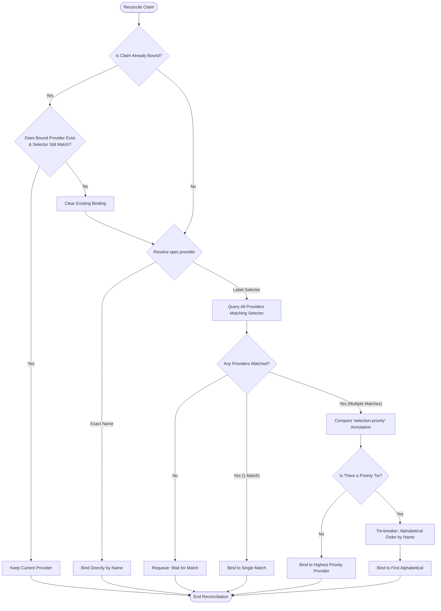

# opendatahub-db-operator

`opendatahub-db-operator` is the database provisioning module for the ODH module
operator monorepo.

It gives other controllers a Kubernetes-native way to ask for PostgreSQL access:

- `SchemaClaim` provisions a schema and a dedicated user inside the provider's
  default database or an explicitly selected one.
- `DatabaseClaim` provisions a dedicated user for a database, using the
  provider default when `spec.database` is omitted and creating an explicitly
  named database when the provider allows it.
- `DatabaseProvider` describes where claims should be provisioned:
  - `External`: a PostgreSQL instance managed outside this operator.
  - `Internal`: a controller-managed single-instance PostgreSQL convenience
    backend.
- `DatabaseService` is the cluster-scoped module-enablement CR used by the
  platform/operator layer. It lives in
  `services.platform.opendatahub.io/v1alpha1`, has an empty `spec`, and must be
  named `default-db-operator`.

The intent is similar to storage classes and PVCs:

- claims express demand
- providers express supply
- the operator binds the two and writes connection details into a Secret in the
  claim namespace

## Quick Start

The normal flow is:

1. create a `DatabaseProvider`
2. create a `SchemaClaim` or `DatabaseClaim`
3. wait for the claim to become `Provisioned=True`
4. read the generated Secret in the claim namespace

For an internal provider, the operator also creates the backing PostgreSQL
resources for you. For an external provider, the PostgreSQL instance already
exists and the operator only validates connectivity and provisions access.

## How It Works

The following diagram illustrates how cluster-scoped database providers reconcile with namespaced database or schema claims:

```text
            ┌───────────────────────────────┐
            │   DatabaseProvider (Supply)   │  ◄─── [ Cluster-scoped ]
            │    (Internal or External)     │
            └───────────────┬───────────────┘
                            ▲
                            │ (References via spec.provider)
                            │
               ┌────────────┴────────────┐
               │                         │
               ▼                         ▼
        ┌─────────────┐           ┌─────────────┐
        │ SchemaClaim │           │DatabaseClaim│  ◄─── [ Namespaced ]
        └──────┬──────┘           └──────┬──────┘
               │                         │
               │ (Reconciled by          │ (Reconciled by
               │  the Operator)          │  the Operator)
               ▼                         ▼
       ┌─────────────┐           ┌─────────────┐
       │   Secret    │           │   Secret    │  ◄─── [ Credentials ]
       │(configured  │           │(configured  │
       │or default)  │           │or default)  │
       └─────────────┘           └─────────────┘
```

### Claims

`SchemaClaim` and `DatabaseClaim` are namespace-scoped resources.

Both claims:

- select a provider by exact name or by label selector
- requeue when `DatabaseProvider` objects change, so late provider creation and
  selector changes are observed without touching the claim
- keep the current provider for selector-based claims while it still matches
- wait until a single reachable provider is resolved
- provision PostgreSQL roles and grants through the controller
- publish connection details in a Secret in the claim namespace, using
  `spec.secretName` when set or the claim name otherwise
- repair missing claim credentials in place; `SchemaClaim` also recreates a
  missing schema
- surface the selected provider in `status.provider` when selection happened by
  label selector
- use `status.conditions[type=Provisioned]` as the main machine-readable signal
- surface TLS state via `status.conditions[type=TLSConfiguration]`

Use `SchemaClaim` when the consumer needs its own schema. Use `DatabaseClaim`
when the consumer needs access to a whole existing database.

### Providers

`DatabaseProvider` is cluster-scoped.

#### External

An `External` provider points at an admin-managed PostgreSQL instance. The
operator validates connectivity with an admin Secret and then provisions claims
against that instance.

The referenced Secret must contain:

- `pg.host`
- `pg.port`
- `pg.user`
- `pg.password`
- `pg.database`, or `spec.defaultDatabase` must be set on the provider

It may also include `pg.sslmode` and `ca.crt` when the external instance
requires TLS verification.

External providers can also declare claim-side lifecycle permissions through
`spec.external.capabilities`:

- `CreateDatabase`
- `CreateSchema`

#### Internal

An `Internal` provider creates and manages:

- a `StatefulSet`
- a `PersistentVolumeClaim`
- a headless `Service`
- an init `ConfigMap`
- a `NetworkPolicy`
- an admin Secret

The internal provider defaults to creating these resources in the operator
namespace, but `spec.internal.namespace` can override that. Claim connections
resolve through the internal Service DNS name:

`<provider-name>.<target-namespace>.svc`

This is a convenience backend, not a full database service:

- one instance
- no HA
- no backup/restore workflow here
- no arbitrary image override in the CRD

Internal providers can also opt into cert-manager-backed TLS with
`spec.internal.tls`. When TLS is enabled, the provider exposes `status.tls`,
providers publish `status.conditions[type=TLSConfiguration]`, and claim Secrets
include the TLS connection keys described below.

If `spec.internal.extensions` requests `vector`, the operator selects the
configured pgvector image. Otherwise it uses the configured stock PostgreSQL
image.

### Security & Network Isolation

Because `DatabaseProvider` is cluster-scoped and claims are namespace-scoped, security and tenant isolation are enforced by default:

- **Dynamic Network Isolation (`Internal` only):** For `Internal` providers, the operator automatically discovers all namespaces with successfully provisioned claims referencing that provider, and dynamically configures the PostgreSQL `NetworkPolicy` to allow ingress traffic *only* from those specific namespaces.
- **Tenant Credential Isolation:** Generated connection Secrets are created directly in the consumer claim's own namespace. A tenant in namespace `A` cannot access or view the connection credentials generated for a tenant in namespace `B`.

## API Summary

### SchemaClaim

Key fields:

- `spec.provider`
- `spec.secretName` optional override for the projected credentials Secret name
- `spec.schema` optional, immutable
- `spec.database` optional, immutable override for the target database
- `spec.access`: `ReadWrite` or `ReadOnly`
- `spec.deletionPolicy`: `Retain` or `Delete`

Status highlights:

- `status.schema`
- `status.connection`
- `status.provider` when the claim resolved a provider by selector
- `status.conditions[type=Provisioned]`
- `status.conditions[type=TLSConfiguration]`

### DatabaseClaim

Key fields:

- `spec.provider`
- `spec.secretName` optional override for the projected credentials Secret name
- `spec.database` optional, immutable; when omitted, the provider default is
  used
- `spec.access`: `ReadWrite` or `ReadOnly`

Status highlights:

- `status.database` resolved effective database, including the provider default
  when `spec.database` is omitted
- `status.connection`
- `status.provider` when the claim resolved a provider by selector
- `status.conditions[type=Provisioned]`
- `status.conditions[type=TLSConfiguration]`

### DatabaseProvider

Key fields:

- `spec.type`: `External` or `Internal`
- `spec.defaultDatabase` optional default database for both claim kinds and
  provider admin connectivity
- `spec.external.connectionSecretRef`
- `spec.external.capabilities` optional claim-side create permissions for
  external providers
- `spec.internal.storage`
- `spec.internal.resources`
- `spec.internal.extensions`: `vector`, `pg_trgm`, `uuid_ossp`, `pgcrypto`
- `spec.internal.namespace` optional override for internal resources
- `spec.internal.tls` optional TLS configuration for the internal instance

Status highlights:

- `status.connection`
- `status.tls`
- `status.conditions[type=Reachable]`
- `status.conditions[type=TLSConfiguration]`

## Examples

Repository sample manifests live in `config/samples/`:

- `config/samples/services_v1alpha1_databaseservice.yaml`
- `config/samples/infrastructure_v1alpha1_databaseprovider_internal.yaml`
- `config/samples/infrastructure_v1alpha1_databaseprovider_external.yaml`
- `config/samples/infrastructure_v1alpha1_schemaclaim.yaml`
- `config/samples/infrastructure_v1alpha1_databaseclaim.yaml`

### External provider

```yaml
apiVersion: v1
kind: Secret
metadata:
  name: external-postgres-admin
  namespace: opendatahub-db
type: Opaque
stringData:
  pg.host: postgres.example.com
  pg.port: "5432"
  pg.user: postgres
  pg.password: secret
---
apiVersion: infrastructure.opendatahub.io/v1alpha1
kind: DatabaseProvider
metadata:
  name: shared-external
spec:
  type: External
  defaultDatabase: postgres
  external:
    connectionSecretRef:
      name: external-postgres-admin
      namespace: opendatahub-db
    capabilities:
    - CreateDatabase
    - CreateSchema
```

### Internal provider

```yaml
apiVersion: infrastructure.opendatahub.io/v1alpha1
kind: DatabaseProvider
metadata:
  name: shared-internal
  labels:
    db.infrastructure.opendatahub.io/capability-pgvector: "true"
spec:
  type: Internal
  internal:
    namespace: opendatahub-db
    storage:
      size: 10Gi
    extensions:
    - vector
    - pg_trgm
```

This creates a controller-managed PostgreSQL instance in `opendatahub-db`.

### SchemaClaim

```yaml
apiVersion: infrastructure.opendatahub.io/v1alpha1
kind: SchemaClaim
metadata:
  name: notebooks
  namespace: team-a
spec:
  provider:
    name: shared-internal
  secretName: notebooks-credentials
  database: appdb
  access: ReadWrite
  deletionPolicy: Retain
```

After reconciliation, the Secret `team-a/notebooks-credentials` contains the
connection information for the provisioned schema user.

### DatabaseClaim

```yaml
apiVersion: infrastructure.opendatahub.io/v1alpha1
kind: DatabaseClaim
metadata:
  name: ml-metadata
  namespace: team-a
spec:
  provider:
    name: shared-external
  secretName: ml-metadata-credentials
  access: ReadWrite
```

After reconciliation, the Secret `team-a/ml-metadata-credentials` contains the
connection information for the provisioned database user.

## Typical Usage

### Use `SchemaClaim` when

- the application should stay inside a shared database
- each tenant or component should get its own schema
- deleting the claim may or may not delete the schema, depending on
  `deletionPolicy`

### Use `DatabaseClaim` when

- the application needs either the provider default database or a dedicated
  database selected in the claim
- the provider may allow the claim to create that explicit database for you
- the operator must not delete the database itself

### Use `External` provider when

- PostgreSQL is already managed elsewhere
- you need functionality outside this module's internal scope
- you want the operator to provision access, not manage database lifecycle

### Use `Internal` provider when

- you want a simple in-cluster PostgreSQL backend
- one instance is enough
- you are fine with the module's intentionally limited operational surface

## Connection Secrets

For provisioned claims, the operator writes a Secret in the claim namespace with
the standard PostgreSQL keys used by this module:

- `pg.host`
- `pg.port`
- `pg.user`
- `pg.password`
- `pg.database`

`SchemaClaim` credentials also include:

- `pg.schema`

When TLS is active for the selected provider, claim Secrets may also include:

- `pg.sslmode`
- `ca.crt`

The Secret name defaults to the claim name, but `spec.secretName` can override
it. These claim Secrets are reconciled in the claim namespace, but they are not
owner-referenced to the claim.

For `Internal` providers, the operator also manages an admin Secret in the
provider namespace using `POSTGRES_USER`, `POSTGRES_PASSWORD`, and
`POSTGRES_DB`.

More operational details, including resource ownership and internal namespace
resolution, are in `docs/operations.md`.

## Provider Selection

`spec.provider` supports exactly one of:

- `name`
- `selector`

When a selector matches more than one provider, the operator picks:

1. the provider with the highest
   `db.infrastructure.opendatahub.io/selection-priority` annotation
2. alphabetical name order as a tie-breaker

Once a selector-based claim has picked a provider, the controller keeps that
provider while it still exists and still matches the selector. A newly created
or higher-priority match does not force rebinding of an already-bound claim.



## Drift Recovery

Claims repair the resources they own when drift is detected:

- `SchemaClaim` recreates a missing schema, role, or credentials Secret
- `DatabaseClaim` recreates a missing role or credentials Secret

Repairs amend the existing claim Secret in place when possible. Credentials only
rotate when the controller has to reprovision the missing database-side state.

## Conditions

Primary conditions to watch:

- claims: `Provisioned`, `TLSConfiguration`, and aggregate `Ready`
- providers: `Reachable`, `TLSConfiguration`
- module CR: `Ready`

## Local Development

Run commands from `modules/opendatahub-db-operator/`.

### Prerequisites

To build, run, and test the operator locally, you will need:

- **Go:** `1.26.5` or later (as specified in `go.mod`)
- **Container Tool:** `podman` (default) or `docker` (configured via `CONTAINER_TOOL` environment variable)
- **Kubernetes Cluster:** A running local cluster (such as Kind, Minikube, or OpenShift Local) with `kubectl` configured and targeted by your active context

### Useful Targets

Useful targets:

- `make manifests generate`
- `make fmt`
- `make lint`
- `make lint-fix`
- `make test`
- `make test-integration` (defaults to `kind`)
- `make test-e2e` (defaults to `kind`)
- `make test-integration-cleanup`
- `make test-e2e-cleanup`
- `make install`
- `make run`
- `make helm`
- `make deploy-helm`
- `make undeploy-helm`

To run integration tests against another supported cluster backend, override the
default cluster type:

```bash
make test-integration INTEGRATION_TEST_CLUSTER_TYPE=external
```

`make test-e2e` now builds and pushes an image, then bootstraps the operator
through the test cluster setup flow inside the selected test cluster. It uses
`E2E_OPERATOR_IMAGE` for the operator image and defaults that value to `$(IMG)`
in the composite target. To run only the e2e suite against another cluster
backend or image, override the test settings explicitly:

```bash
make test-e2e-run \
  E2E_OPERATOR_IMAGE=quay.io/example/opendatahub-db-operator:test \
  ODH_MODULE_OPERATOR_TEST_CLUSTER_TYPE=external
```

### Configuration

Configuration is loaded from:

1. built-in defaults
2. files under `ODH_MODULE_OPERATOR_CONFIGURATION_PATH`
3. environment variables prefixed with `ODH_MODULE_OPERATOR_`

Important keys:

- `operator-namespace`
- `platformType`
- `platformVersion`
- `controller.metrics.bind-address`
- `controller.health.bind-address`
- `controller.leader-election.enabled`
- `controller.leader-election.id`
- `controller.zap.level`
- `controller.zap.dev-mode`
- `controller.zap.encoder`
- `controller.pprof.enabled`
- `controller.pprof.bind-address`
- `internal.postgres-image`
- `internal.pgvector-image`
- `grace-period`
- `schemaclaim.retry-interval`
- `databaseclaim.retry-interval`
- `databaseprovider.retry-interval`
- `databaseservice.retry-interval`

Example overrides:

```bash
export ODH_MODULE_OPERATOR_OPERATOR_NAMESPACE=odh-db-operator-system
export ODH_MODULE_OPERATOR_DATABASEPROVIDER_RETRY_INTERVAL=2m
export ODH_MODULE_OPERATOR_INTERNAL_POSTGRES_IMAGE=postgres:16
export ODH_MODULE_OPERATOR_INTERNAL_PGVECTOR_IMAGE=pgvector/pgvector:pg16
```

## Without Cloning

You can also use the module directly from GitHub.

Install CRDs from the repo:

```bash
kubectl apply -k "github.com/lburgazzoli/opendatahub-module-operator/modules/opendatahub-db-operator/config/crd?ref=<branch-or-tag>"
```

Apply the sample resources from the repo:

```bash
kubectl apply -k "github.com/lburgazzoli/opendatahub-module-operator/modules/opendatahub-db-operator/config/samples?ref=<branch-or-tag>"
```

Run the operator directly with Go:

```bash
go run github.com/lburgazzoli/opendatahub-module-operator/modules/opendatahub-db-operator@<branch-or-tag> operator
```

Replace `<branch-or-tag>` with the branch or tag you want to run.

## Notes For Maintainers

- Generated files must be refreshed with `make manifests generate` after API
  changes.
- Do not hand-edit generated CRD YAML or deepcopy files.
- `config/crd/kustomization.yaml` must include the generated CRD bases for
  `make install` to work.
